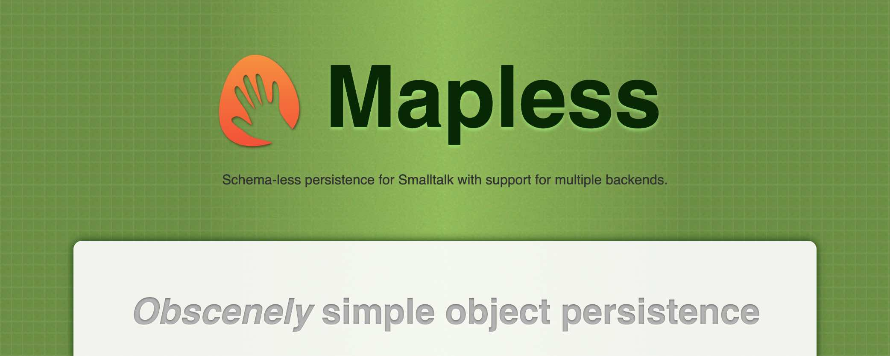

# Mapless

Schema-less persistence for Smalltalk with support for multiple backends.

[](https://github.com/sebastianconcept/Mapless/releases)
[](https://github.com/sebastianconcept/Mapless/actions/workflows/build.yml)


[](https://codecov.io/gh/sebastianconcept/Mapless/branch/master)


[](https://pharo.org/download)
[](https://pharo.org/download)

[]()
[]()
[](./LICENSE.txt)

### [Mapless GitHub Page](https://sebastianconcept.github.io/Mapless/)

Jump to [How to Install](#how-to-install)

---

## Description

Mapless is a schema-less persistence framework supporting multiple backends and offering a user-friendly API. Querying Mapless objects involves a common family of methods, and there's no need to declare accessors and mutators. See [examples below](#examples).

Designed to eliminate the need for schema maintenance, Mapless avoids any Object-Relational Mapping requirements.

Mapless achieves a balance between maximum data survivability and robust architectural flexibility without imposing a heavy burden in terms of adoption and maintenance. A sweet spot for development and production.

## Features

- Intuitive API for frictionless persistence.
- No need to create and maintain schemas.
- Composable.
- JSON friendly.
- No need to create accessors and mutators.
- Multiple backends to choose from.
- Enables smooth data migration/interoperation among backends.
- ~~Via Redis PUB/SUB, scalable observer-pattern functionality across images.~~ In the roadmap.

## Supported backends

1. SQLite
2. PostgreSQL
3. Redis
4. MongoDB
5. Memory
6. ~~UnQLite~~ `deprecated` / retiring soon

## Examples
Try Mapless by [installing it in a supported Pharo image](#how-to-install) and the following snippets:

```Smalltalk
"Instantiates an SQLite Mapless repository."
repository := MaplessSQLiteRepository
    for: 'TryMapless'
    on: 'path/string/to/your/sqlite.db'.
```

```Smalltalk
"Custom class to model your data"
Mapless subclass: #Person
	instanceVariableNames: ''
	classVariableNames: ''
	package: 'YourApp-Mapless'

"Guarantees the database has a Person table (this is idempotent)."
repository ensureTableFor: Person.

"Instantiates a Mapless object."
philosopher := Person new
	firstName: 'Aristotle';
	yourself.

"Saves it."
repository save: philosopher.
```

```Smalltalk
"Loads one by known ID."
identified := repository findOne: Person atId: philosopher id.
```

```Smalltalk
"Loads all instances of that class that were stored in that database."
allOrEmpty := repository findAll: Person.
```

```Smalltalk
"Query to load all the instances that match the condition."
someOrEmpty := repository findAll: Person where: [ :each | 
  each firstName = 'Aristotle' ].
```

```Smalltalk
"Conditionally loading the first matching instance."
oneOrNil := repository findOne: Person where: [ :each | 
  each firstName = 'Aristotle' ].
```

```Smalltalk
"Create a Person Mapless model"
philosopher := Person new
	firstName: 'Aristotle';
	save.

"Set it as the person for a new User Mapless model"
philosopherUser := User new
	person: philosopher;
	save.  

"Query for that user by ID and get its person instance"
aristotle := (User findId: philosopherUser id) person.
```
## How to install

To start with Mapless, download Pharo, open a Pharo Playground and evaluate:

```smalltalk
"Load latest version of Mapless with its default backends (Memory and SQLite)"
Metacello new
  baseline: 'Mapless';
  repository: 'github://sebastianconcept/Mapless:latest/src';
  load.
```
```smalltalk
"Load latest version of Mapless specifying which backends explicitely"
Metacello new
  baseline: 'Mapless';
  repository: 'github://sebastianconcept/Mapless:latest/src';
  load: #('Core' 'SQLite' 'Postgres' 'Mongo' 'Redis' 'Memory') 
```

## Include as dependency

To include Mapless as a dependency from `BaselineOf` or `ConfigurationOf` add it with:

```smalltalk
spec
  baseline: 'Mapless'
    with: [ spec
    repository: 'github://sebastianconcept/Mapless:latest/src';
    load: #('Core' 'SQLite' 'Postgres' 'Mongo' 'Redis' 'Memory') ]
```
## Project Ambition

To deliver a high-performance solution that preserves arbitrary application state (data) with a focus on flexibility, availability, and capacity. It aims to strategically aid in scaling without causing vendor lock-in, across various persistence backends, and by neutralizing the costs associated with object-mapping impedance mismatch.
