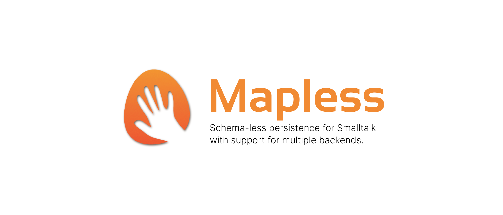

# Mapless

Schema-less persistence for Smalltalk with support for multiple backends.

[](https://github.com/sebastianconcept/Mapless/actions/workflows/build.yml)

[](https://codecov.io/gh/sebastianconcept/Mapless/branch/master)

[](./LICENSE.txt)
[](https://github.com/sebastianconcept/Mapless/releases)


[](https://pharo.org/download)
[](https://pharo.org/download)

[]()
[]()

---

## Features

- Intuitive API for frictionless persistence.
- No need to create and maintain schemas.
- Composable.
- JSON friendly.
- No need to create accessors and mutators.
- Multiple backends to chose from.
- Enables smooth data migration/interoperation among backends.
- ~~Via Redis PUB/SUB, scalable observer-pattern functionality across images.~~ In the roadmap.

## Ambition

Mapless gives you performant state plasticity and high availability in a scale that goes beyond one Smalltalk image and without backend vendor locking nor object-mapping impedance mismatch.

## Supported backends

1. MongoDB
2. Redis
3. Memory
4. PostgreSQL
5. ~~UnQLite~~ `deprecated` / retiring soon

## Examples

```Smalltalk
"Instanciates a mapless object."
genius := DummyPerson new
	firstName: 'Aristotle';
	yourself.

"Saves it."
repository save: genius.
```

```Smalltalk
"Loads one by known ID."
identified := repository findOne: DummyPerson atId: genius id.
```

```Smalltalk
"Loads all instances of that class that were stored in that database."
allOrEmpty := repository findAll: DummyPerson.
```

```Smalltalk
"Query to load all the instances that match the condition."
someOrEmpty := repository findAll: DummyPerson where: [ :each | each lastName = 'Peterson' ].
```

```Smalltalk
"Conditionally loading the first matching instance."
oneOrNil := repository findOne: DummyPerson where: [ :each | each lastName = 'Peterson' ].
```

## Installation

Open a Pharo workspace and evaluate:

```smalltalk
Metacello new
  baseline: 'Mapless';
  repository: 'github://sebastianconcept/Mapless:v0.5.7/src';
  load
```

## Include as dependency

In BaselineOf or ConfigurationOf it can be added in this way:

```smalltalk
spec
  baseline: 'Mapless'
    with: [ spec
    repository: 'github://sebastianconcept/Mapless:v0.5.0-alpha/src';
    load: #('Core' 'Mongo' 'Memory' 'Redis' 'UnQLite') ]
```
