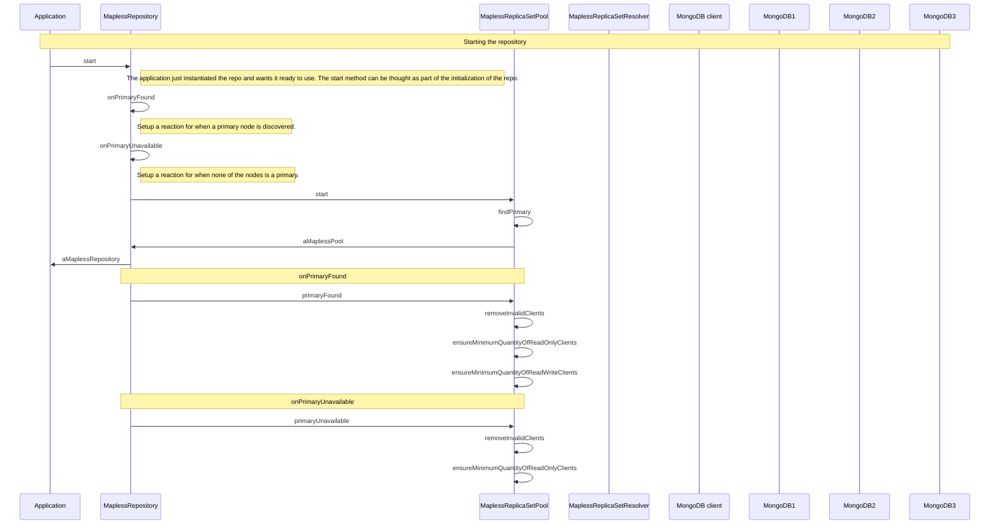
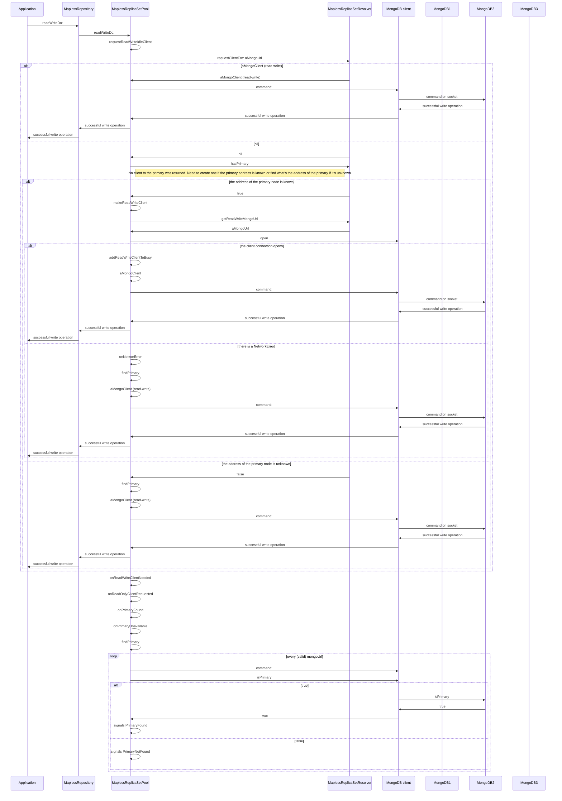
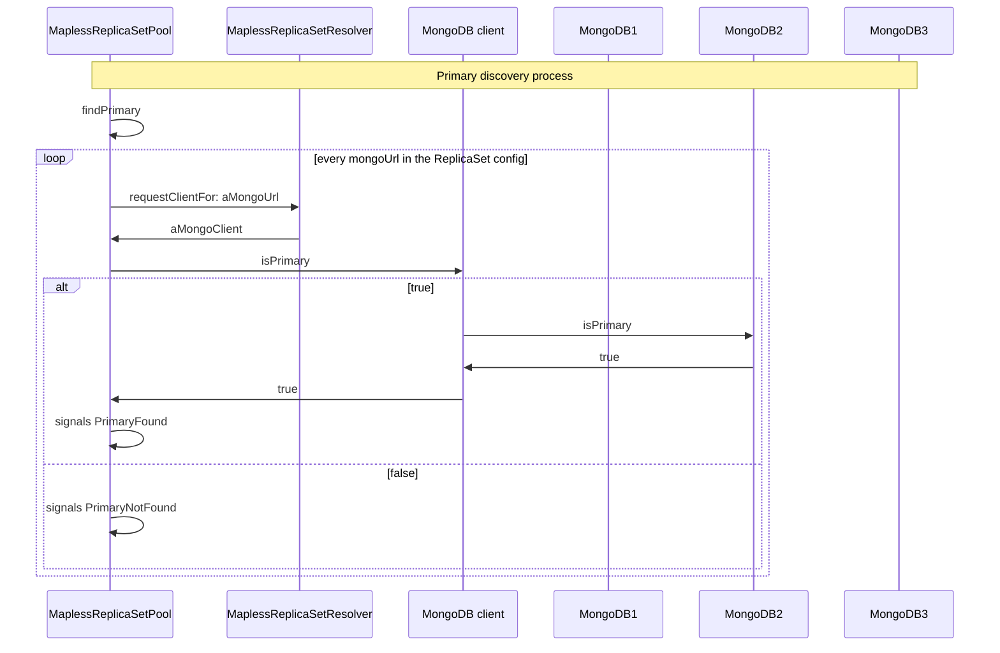

# MongoDB replica set

Sequence diagrams for a Mapless repository on a MongoDB replica set: startup, a write that has to find the primary, and primary discovery. MongoDB2 is the primary.

## Replica set starts

## Write while finding the primary

## Primary discovery

